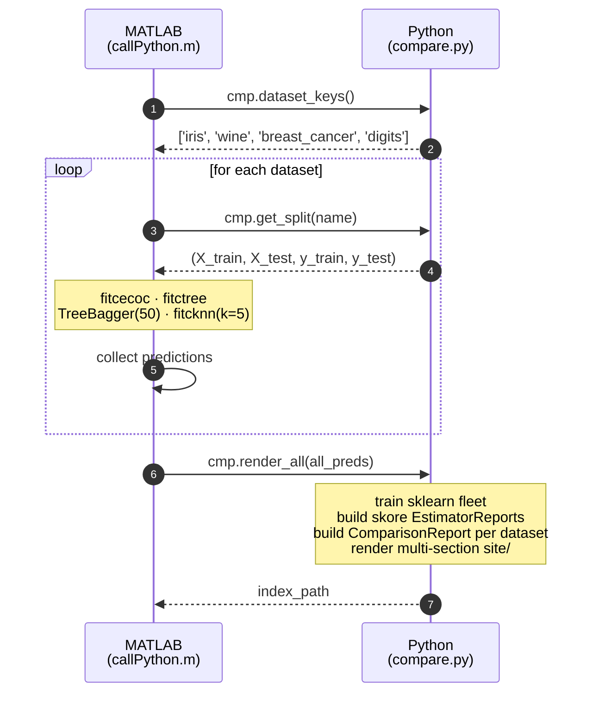

# MATLAB vs scikit-learn

[](https://github.com/yanndebray/matlab-with-scikit-learn/actions/workflows/matlab-engine.yml)
[](https://yanndebray.github.io/matlab-with-scikit-learn/)

> **A skore benchmark across 4 datasets and 8 classifiers.**
> MATLAB R2025b's Statistics & ML Toolbox squares off against scikit-learn on
> the exact same train/test splits, framed with [skore](https://skore.probabl.ai)
> and rendered to GitHub Pages on every push to `main`.

**[→ Open the latest live report](https://yanndebray.github.io/matlab-with-scikit-learn/)**

## What's in the benchmark

| Side        | Classifiers                                                              |
| ----------- | ------------------------------------------------------------------------ |
| **MATLAB**  | `fitcecoc` · `fitctree` · `TreeBagger(50)` · `fitcknn(k=5)`              |
| **sklearn** | `LogisticRegression` · `DecisionTree` · `RandomForest(50)` · `KNN(k=5)` |

| Dataset           | Task                                                       | Shape         |
| ----------------- | ---------------------------------------------------------- | ------------- |
| **Iris**          | Multiclass — flower species                                | 150 × 4       |
| **Wine**          | Multiclass — wine cultivars                                | 178 × 13      |
| **Breast cancer** | Binary — malignant vs benign                               | 569 × 30      |
| **Digits**        | Multiclass — handwritten digits                            | 1797 × 64     |

Linear sklearn estimators (`LogisticRegression`, `KNN`) are wrapped in a
`StandardScaler` pipeline so the comparison reflects realistic out-of-the-box
sklearn usage.

## Confusion matrices (best of each side, per dataset)

Each image pairs MATLAB's best classifier with sklearn's best classifier on
that dataset. Updated automatically by CI.

|                |                                                                                       |
| -------------- | ------------------------------------------------------------------------------------- |
| Iris           |                 |
| Wine           |                 |
| Breast cancer  |        |
| Digits         |               |

## How it works

MATLAB drives the pipeline; Python is invoked through MATLAB's `py.*` interop:



CI installs MATLAB R2025b via `matlab-actions/setup-matlab`, runs
`callPython.m` via `matlab-actions/run-command`, then `actions/deploy-pages`
publishes `site/` to GitHub Pages.

## Repository layout

| File                                  | Role                                                                  |
| ------------------------------------- | --------------------------------------------------------------------- |
| `callPython.m`                        | MATLAB entry point — trains the MATLAB fleet across all datasets.     |
| `compare.py`                          | Dataset registry, sklearn fleet, skore reports, HTML site renderer.   |
| `.github/workflows/matlab-engine.yml` | CI: MATLAB + Python + skore + GitHub Pages deploy.                    |

## Run locally

Requires MATLAB R2025b (with Statistics & ML Toolbox) and Python 3.12:

```bash
python3 -m pip install scikit-learn numpy matplotlib skore
matlab -batch "callPython"
open site/index.html
```
