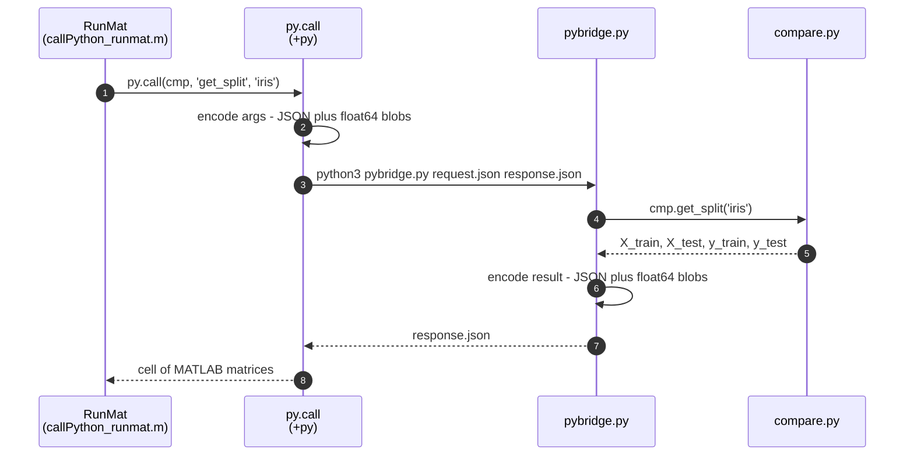

# Porting this benchmark to RunMat

This branch runs the MATLAB-vs-scikit-learn benchmark on
[RunMat](https://runmat.org) 0.6.1 instead of MATLAB R2025b. The Python side
is untouched: `compare.py` still owns the splits, the sklearn fleet, the skore
reports, and the HTML. What changed is the driver and, mostly, the interop.

```
runmat test_pyinterop.m        # 24 interop checks
runmat callPython_runmat.m     # the benchmark; writes site/index.html
```

Both must run from the repo root — RunMat resolves `classdef` files from the
working directory only (see [Gaps](#runmat-gaps-found-along-the-way)).

## Why there is a bridge in here at all

RunMat has no Python interop: no `py.*` namespace, no `pyrun`, no `pyenv`.

```matlab
>> py.importlib.import_module('compare')
error: undefined variable 'py'
>> pyrun("a = 1", "a")
error: Undefined function: pyrun
```

So this branch ships one. `pybridge.py` is the Python half; `+py/` is the
MATLAB half; `PyObject`/`PyDict`/`pyargs` are the value types. Nothing is
compiled and nothing runs in the background: each interop call writes a JSON
request, runs `python3 pybridge.py request.json response.json`, and reads the
answer back.



One interpreter launch per call is fine here: the whole benchmark makes six.
Matrices never go through JSON — they are written as raw column-major float64
next to the request, so numpy reads them with a `reshape` and no parsing. A
Python object with no MATLAB equivalent (an estimator, say) is pickled into the
session directory and handed back as a handle, which the next call can accept
as an argument.

## The API

| MATLAB | This port | Notes |
| --- | --- | --- |
| `py.importlib.import_module('compare')` | same | imports for real, so a broken module fails here |
| `py.importlib.reload(cmp)` | same | every call is a fresh interpreter, so this is a no-op that still type-checks the module |
| `cmp.get_split(key)` | `py.call(cmp, 'get_split', key)` | RunMat cannot dispatch a dotted call through `subsref` |
| `cmp.some_attribute` | same | `subsref` handles plain attribute reads |
| `f = cmp.dataset_keys; f()` | same | a callable attribute comes back as a bound `PyObject` |
| `pyargs('output_dir', d)` | same | keyword arguments |
| `py.dict()`, `d{'k'} = v`, `d{'k'}` | same | built on the MATLAB side, converted on the way out |
| `py.numpy.array(x)` | same | pass-through: the bridge already sends numeric data as numpy arrays |
| `pyenv` | `py.info()` | interpreter path, version, and the versions of numpy/sklearn/matplotlib/skore |
| — | `py.eval(expr, names)`, `py.exec(code, names, out)` | `pyrun`-shaped escape hatches |
| — | `py.matrix(x)` | keep a vector 2-D instead of squeezing it to 1-D |
| — | `py.free(handle)`, `py.session('reset')` | drop pickled handles |

Conversions:

| Python | MATLAB |
| --- | --- |
| `int` / `float` | `double` |
| `str` | `char` |
| `bool` | `logical` |
| `None` | `[]` |
| `numpy` array | `double` / `logical` matrix (1-D becomes a row) |
| `list` / `tuple` | `cell` |
| `dict` | `PyDict` |
| anything else | `PyObject` handle (pickled) |

Going the other way, a scalar `struct` becomes a `dict`, a `cell` becomes a
`list`, and a row or column vector becomes a 1-D numpy array — which is what
sklearn wants for labels. `py.matrix` opts out of that last one.

Environment variables: `RUNMAT_PYTHON` picks the interpreter,
`RUNMAT_PY_VERBOSE=0` mutes the Python side's stdout, `RUNMAT_PY_KEEP=1` keeps
each call's scratch directory (request, response, blobs) for inspection.

## What the benchmark loses, for now

RunMat ships `fitctree`, and it is the real thing — 94.7% on the iris split,
matching MATLAB's tree. It does not ship `fitcecoc`, `fitcknn`, or
`TreeBagger`:

```matlab
>> exist('fitctree'), exist('fitcknn'), exist('fitcecoc'), exist('TreeBagger')
ans = 5    ans = 0    ans = 0    ans = 0
```

So the MATLAB side of the port is currently `fitctree` plus `knnPredict.m`, a
plain-MATLAB k-NN standing in for `fitcknn(k=5)` (standardise, then the modal
label of the 5 nearest neighbours). Current numbers:

| Dataset | `fitctree` | `knn(k=5)` |
| --- | --- | --- |
| Iris | 0.9474 | 0.9737 |
| Wine | 0.8889 | 0.9333 |
| Breast cancer | 0.9231 | 0.9510 |
| Digits | 0.8511 | 0.9733 |

Porting the other three is the next piece of work: an ECOC wrapper over a
linear SVM and a bagged-tree ensemble are both writable on top of `fitctree`,
which is more interesting than it sounds — it turns the "MATLAB side" of the
benchmark into RunMat-plus-MATLAB-code rather than a toolbox call.

Unrelated to the port: `compare.py` does not run against skore 0.25, which
rejects `EstimatorReport(fitted_est, X_train=..., y_train=...)` — the pattern
`_run_dataset` uses for both fleets. This branch was verified against skore
0.19.0. The MATLAB workflow installs whatever is latest, so `main` needs the
same pin or a report-construction fix.

## RunMat gaps found along the way

Each of these is reduced to the smallest thing that reproduces it, and each is
worked around in this branch. They are worth filing upstream; together they
are most of the reason the port is not a one-line rename.

**1. `switch` on text does not work.** Every case label is coerced to a
number, so any `switch` over strings — the backbone of most MATLAB dispatch
code — fails.

```matlab
function f(t)
  switch t
    case 'a', disp('A');
    otherwise, disp('other');
  end
end
% error: cannot convert CharArray('a') to f64
```

A cell case label fails even for numbers: `case {2, 3}` gives
`cannot convert Cell(...) to f64`. Both `+py/decode.m` and the two classdefs
here are written as `strcmp` chains because of this.

**2. A package file runs its last function, not the one you named.**

```matlab
% +z/main.m
function out = main(x), out = ['main:' inner(x)]; end
function out = inner(x), out = ['inner(' x ')']; end

>> z.main('q')
ans = inner(q)          % expected main:inner(q)
```

Reversed, `z.rev('q')` reports `Undefined function: helper` — so siblings are
invisible to each other too. Every package file here holds exactly one
function; `py.blob` and `py.readblob` exist as separate files only for this
reason.

**3. A logical property default panics the compiler.**

```matlab
classdef D
    properties
        a = false
    end
end
% thread 'main' panicked at crates/runmat-hir/src/lowering/ctx.rs:579:28:
% semantic lowering scope
```

The panic is not confined to code that uses the class: while such a file sits
in the working directory, *every* script in that directory fails to compile,
which makes it a puzzling first thing to hit. `PyDict` stores its flag as `0`
and `1`.

**4. A `{}` property default is not a cell.** It arrives as a double, so the
usual accumulator pattern fails:

```matlab
classdef G
    properties
        c = {}
    end
    methods
        function obj = push(obj, v), obj.c{end + 1} = v; end
    end
end
% error: Cell assignment on non-cell
```

`obj.c = [obj.c, {v}]` fails too (`cannot mix cell arrays with other
classes`). Initialising in the constructor works, and mutation needs a local
copy: `tmp = obj.c; tmp{end + 1} = v; obj.c = tmp;`. Both classdefs here
declare properties without defaults.

**5. `persistent` variables start at `0`, not `[]`.** The documented MATLAB
idiom silently skips initialisation:

```matlab
function out = f()
  persistent state
  if isempty(state)      % false: state is 0, not []
    state = 'init';
  end
  out = state;
end
```

`+py/session.m` tests `~ischar(home)` instead.

**6. Fields on a persistent struct lower to a graphics `get`.**

```matlab
function out = f()
  persistent st
  if ~isa(st, 'struct'), st = struct(); st.calls = 0; end
  st.calls = st.calls + 1;
  out = st;
end
% error: get: invalid argument: get: unsupported root property `calls`
```

So `py.session` keeps one persistent variable per field.

**7. Indexing a struct field lowers to `getfield` with the index.**

```matlab
s = struct(); s.shape = [1 4];
v = s.shape(:);
% error: getfield: invalid index element (index must be >= 1)
```

Split it in two: `v = s.shape; v = v(:);`.

**8. Assignment through a logical mask always fails.**

```matlab
v = [1 0 3];
v(v == 0) = 9;
% error: Index out of bounds
```

`knnPredict.m` guards constant columns with `sigma = sigma + (sigma == 0)`.

**9. `==` between arrays of a few hundred elements fails.** The accelerate
layer moves them onto the device, and the comparison cannot come back:

```matlab
a = zeros(450, 1); b = zeros(450, 1);
c = (a == b);
% error: cannot convert GpuTensor(GpuTensorHandle { shape: [450, 1], ... }) to f64
```

`sum(a == b)`, `mean(a == b)`, and `gather(a == b)` all fail the same way;
gathering the *operands* first works, and so does `abs(a - b) < 0.5`. Note
that `double(x)` does not bring a device array home — only `gather(x)` does,
which is worth knowing before you chase a type error. `accuracy.m` exists
because `mean(yhat == y_test)` is not usable here, and `py.readblob` gathers
so that bridge results are always host-side.

**10. `obj.method(args)` does not consult a user-defined `subsref`.**

```matlab
o.attribute        % -> subsref, type '.'      (works)
o(7)               % -> subsref, type '()'     (works)
o.method(7)        % error: Undefined property 'method' for class SR
```

This is the one gap that shows in the port's source: `cmp.get_split(key)`
cannot work, so the driver reads `py.call(cmp, 'get_split', key)`. Chaining
through the two-step form (`f = cmp.get_split; f(key)`) does work, and the
test suite covers it. Relatedly, a function handle in a struct field is not
callable — `s.f = @(a, b) a + b; s.f(2, 3)` gives `Struct contents reference
from a non-struct array object` — which rules out the other obvious way to
fake attribute dispatch.

**11. Missing builtins.** `isstruct` (use `isa(x, 'struct')`), `substruct`,
`isinteger`, `pyenv`. `strjoin` rejects a cell of char vectors and wants a
string array; `ismember` rejects text entirely. Also `properties(obj)` is a
parse error inside a script, because `properties` is treated as a keyword
everywhere.

**12. `exist` reports non-`.m` files as 3.** MATLAB says 2 for any file, so
`exist(f, 'file') ~= 2` — a common guard — is wrong on RunMat for a `.py` or
`.json` path. Only `0` reliably means missing.

**13. `classdef` files are not found through `addpath`.** Functions and
packages are; a class on an added path fails with
`Function source '.../SR.m' does not define 'SR'`. That is why `PyObject.m`
and `PyDict.m` sit in the repo root next to the driver rather than in a
subdirectory with the rest of the bridge.

**14. Diagnostics that mislead.** `error()` does not expand `\n` in its format
string (build the message with `sprintf` first). Error locations frequently
point at an unrelated line — several bugs above were found by bisecting, not
by reading the reported line. And when a script dies, RunMat replays the
output it already printed, so the transcript shows every line twice.
